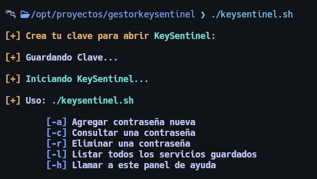
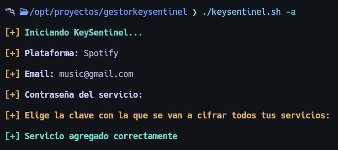
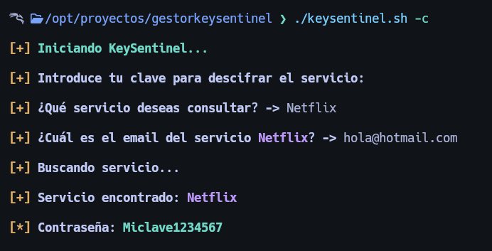
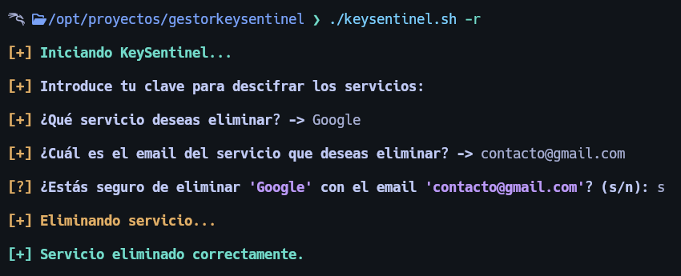
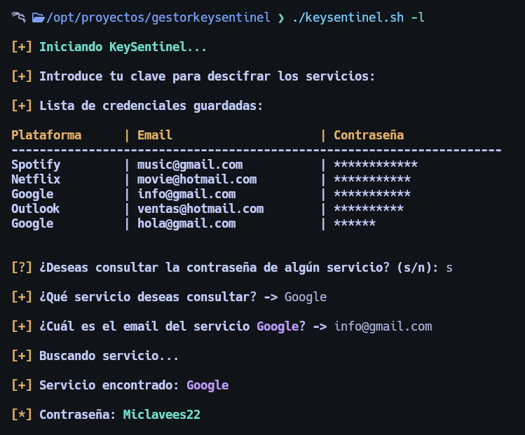

# KeySentinel (Gestor de Contraseñas)

Este es un gestor de contraseñas desarrollado en Bash. Utiliza `gpg` para cifrar y proteger las credenciales almacenadas en un archivo local. Este script permite:

- Crear una clave maestra para iniciar sesión
- Agregar nuevas contraseñas para servicios
- Consultar contraseñas guardadas
- Eliminar servicios guardados
- Listar todas las credenciales almacenadas

---

## Características

- Cifrado con GPG simétrico para mayor seguridad.
- Lógica de sesión de 5 minutos para autenticación.
- Almacenamiento de datos encriptado localmente.
- Interfaz simple mediante línea de comandos.

---

## Requisitos

- GNU Bash
- `gpg` (GnuPG)

---

## Instalación

Clona el repositorio y da permisos de ejecución:

```bash
git clone https://github.com/Gabriel-GR14/gestorkeysentinel.git
cd gestorkeysentinel
chmod +x keysentinel.sh
```

---

## Inicio de KeySentinel

```bash
./keysentinel.sh
```

Debes crear tu clave maestra para iniciar KeySentinel (misma clave que usarás para loguearte cuando la sesión expire)





## Uso

```bash
./keysentinel.sh [opción]
```

### Opciones:

| Opción | Descripción                  |
| ------ | ---------------------------- |
| `-a`   | Agregar una nueva contraseña |
| `-c`   | Consultar una contraseña     |
| `-r`   | Eliminar una contraseña      |
| `-l`   | Listar todas las contraseñas |
| `-h`   | Mostrar el panel de ayuda    |

---

## Ejemplos

### 1. Agregar una contraseña

```bash
./keysentinel.sh -a
```

Se te pedirá:

- Plataforma (nombre del servicio)
- Email
- Contraseña del servicio
- Clave maestra para cifrar las credenciales (se te pedirá una primera vez para crearla y esa misma clave será para cifrar y descifrar tus credenciales)





### 2. Consultar una contraseña

```bash
./keysentinel.sh -c
```




### 3. Eliminar un servicio

```bash
./keysentinel.sh -r
```




### 4. Listar servicios guardados

```bash
./keysentinel.sh -l
```




---

## Seguridad

- Las credenciales se almacenan en `.logpass.gpg`, cifrado con `gpg`
- La sesión se guarda por 5 minutos en `.session.time`
- La clave maestra se solicita si la sesión expira

---

## Estructura del Proyecto

```
gestorkeysentinel/
├── keysentinel.sh
├── .log.gpg            # Archivo cifrado de la clave maestra
├── .logpass.gpg        # Archivo cifrado de servicios
├── .session.time       # Control de sesión
└── img/
    └── screenshots/     # Imágenes del uso
```

---

## Nota Final

Este script es para uso educativo o personal. No reemplaza gestores profesionales como Bitwarden o 1Password. Usa GPG correctamente y respalda tus claves de forma segura.

